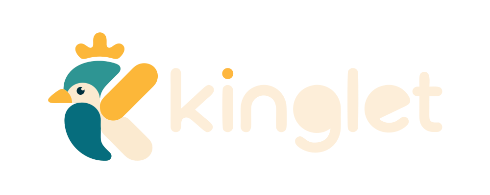

<p align="center">
  <picture>
    <source media="(prefers-color-scheme: dark)" srcset="assets/brand/brand-dark.svg">
    <source media="(prefers-color-scheme: light)" srcset="assets/brand/brand.svg">
    
  </picture>
</p>

<p align="center">A C++-flavored systems programming language with first-class pattern matching, compiled to bytecode VM.</p>

> Familiar to C++ developers from day one. Pattern matching as primary control flow. Runtime small enough to embed.

## Build

```bash
gn gen out/Release --args='is_debug=false'
ninja -C out/Release
./out/Release/kinglet [--tokens | --ast | --bytecode | --repl] <file.kl>
```

## Quick Example

```kinglet
using io;

struct Point {
  int x;
  int y;
}

enum Direction {
  Up,
  Down,
  Left,
  Right,
}

int main() {
  Point p { 10, 20 };
  io::out(p.x);
  io::out(p.y);

  Direction d = Direction::Up;
  inspect (d) {
    Direction::Up => io::out("going up"),
    Direction::Down => io::out("going down"),
    _ => io::out("sideways")
  };

  return 0;
}
```

## Syntax

```kinglet
// Types
int x = 42;          auto x = 42;         const x = 42;

// Structs & Enums
struct Vec2 { int x; int y; }
enum Color { Red, Green, Blue, }
Vec2 v { 1, 2 };
Color c = Color::Red;

// Control flow
if (x > 0) { ... } else { ... }
while (x < 10) { ... }
for (int i = 0; i < 10; i += 1) { ... }

// Pattern matching
auto r = inspect (x) { 1 => a, 2 => b, _ => c };

// I/O
using io;           io::out("{}", x);
using namespace io; out("hello\n");

// Functions
int add(int a, int b) => a + b;
```

## Operators

`+` `-` `*` `/` `%` `==` `!=` `<` `>` `<=` `>=` `&&` `||` `!` `~` `=` `+=` `-=` `*=` `/=`
